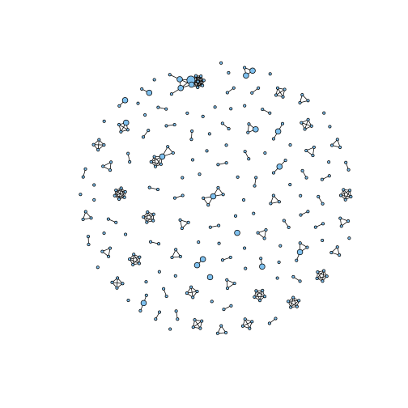
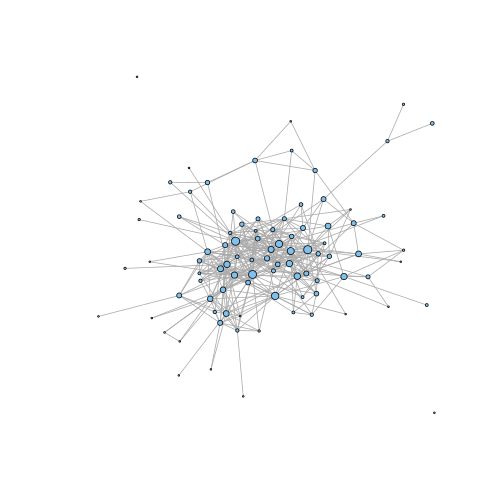
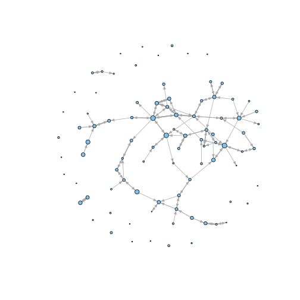
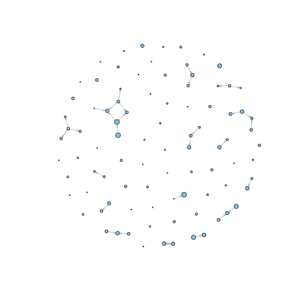

Author networks
==========================

An author network is a network of authors of documents/texts. Common author networks are based on co-authorship (which author collaborated) or conversations (who communicated with whom). 

In this howto we show several functions to create author networks, based on common ways in which author information of documents is stored.


```r
library(networktools)
```


Co-author networks
=====================

For the co-author network, we use scientific articles in 10 communication sciences journals from Web of Science, with 'social network' as a topic, from 2001 till 2009.


```r
load("../demo/abstracts_socialnet.rdata")

head(meta)
```

```
##           id       date                                      journal
## 405 82983674 2009-06-01                       COMMUNICATION RESEARCH
## 399 82983680 2009-06-01                     JOURNAL OF COMMUNICATION
## 368 82983711 2009-03-01 JOURNAL OF SOCIAL AND PERSONAL RELATIONSHIPS
## 299 82983780 2008-12-01                       PERSONAL RELATIONSHIPS
## 292 82983787 2008-10-01 JOURNAL OF SOCIAL AND PERSONAL RELATIONSHIPS
## 274 82983805 2008-07-01                 HUMAN COMMUNICATION RESEARCH
##                                             authors    period
## 405                                        Lee, FLF 2007/2009
## 399                          Eveland, WP;Hively, MH 2007/2009
## 368 Romano, LJ;Hubbard, JA;McAuliffe, MD;Morrow, MT 2007/2009
## 299                      Williams, SL;Mickelson, KD 2007/2009
## 292                           Blair, KL;Holmberg, D 2007/2009
## 274                                      Feeley, TH 2007/2009
```


To create co-author networks, we only need to know which authors (co-)authored which documents. A good way to represent this information is a data.frame in which one column represents document_id's and one column represents authors, or a matrix in which rows are documents and columns are authors. 

However, if author information is stored as meta data of documents, multiple authors are often stored within the same author field/column (as is the case in our example). As the R language is not very intuitive for reorganizing this data (without botheringly inefficient loops) we offer a function for this purpose.

The strsplit function is essentially the `strsplit()` function (base function), but returns the splitten parts of the strings (substrings) as rows. 


```r
coauthors = strsplit.to.rows(x = meta$authors, id = meta$id, split_by = ";")
head(coauthors)
```

```
##          id order     substring
## 1  82983674     1      Lee, FLF
## 9  82983680     1   Eveland, WP
## 10 82983680     2    Hively, MH
## 17 82983711     1    Romano, LJ
## 18 82983711     2   Hubbard, JA
## 19 82983711     3 McAuliffe, MD
```


Now we have the data in the right format, we can use the `author.coincidence.graph` function to make the graph. The name of the function refers to how the graph is created: It counts how many times authors co-incide as authors of the same documents.

The first argument of the function is a vector with the id's for documents in which an author authored. The second argument is the (unique) author name/id. We can directly use the output from strsplit.to.rows. 


```r
g = author.coincidence.graph(coauthors$id, coauthors$substring)  # In how many documents did author.X and author.Y co-author?
```


The output is a graph in the igraph format. 


```r
plot(g, vertex.size = V(g)$n.documents * 2, vertex.label = "", edge.color = "black")
```

 


Conversation networks
=====================

For the conversation network, we use speech acts in Dutch parliamentary proceedings by two parties (VVD and CDA) from 2003 till 2005 (samples of 100 proceedings per year). 


```r
load("../demo/parliamentary_proceedings.rdata")
meta$author = paste(meta$name, meta$party)
head(meta)
```

```
##             id       date speech_act                 meeting
## 33003 33907051 2003-01-29         48 h-tk-20022003-2793-2802
## 32995 33907175 2003-01-30         22 h-tk-20022003-2821-2849
## 81497 33909339 2003-02-18        248 h-tk-20022003-3055-3080
## 81480 33909445 2003-02-20         37 h-tk-20022003-3153-3161
## 81478 33909462 2003-02-20         54 h-tk-20022003-3153-3161
## 32630 33910920 2003-03-18          8 h-tk-20022003-3316-3327
##                         name party year                     author
## 33003         De heer Blaauw   VVD 2003         De heer Blaauw VVD
## 32995    De heer Van Aartsen   VVD 2003    De heer Van Aartsen VVD
## 81497 Mevrouw Vroonhoven-Kok   CDA 2003 Mevrouw Vroonhoven-Kok CDA
## 81480          De heer Atsma   CDA 2003          De heer Atsma CDA
## 81478          De heer Atsma   CDA 2003          De heer Atsma CDA
## 32630           De heer Zalm   VVD 2003           De heer Zalm VVD
```


The column `meeting` represents the meetings in which speech acts are performed. `speech_act` represents the order in which people have spoken. `author` represents the unique participants in the discussion. These are the main variables to create the network. Note that on the internet many interactions fit this format, such as discussion boards (thread-postnr-author).

We present three functions to make a conversation network. The first is the same way as for the co-author network. The order in which authors have spoken is then ignored, and ties represent only how often authors participated in the same conversation. Because we are now also interested in how many times authors participated within a meeting, we can also use a different measure (e.g., cosine) to calculate the coincidence.


```r
g = author.coincidence.graph(meta$meeting, meta$author, "cosine")  # To what extent did politicians participate in the same conversations?
plot(g, vertex.size = sqrt(V(g)$n.documents), vertex.label = "")
```

 


The second way to make the conversation network does take order into account. With `previous.authors.graph` we can draw ties between authors who communicated within a given distance of speech acts. The `lookback` argument indicates the max distance between the speech act of an author and the previous authors. For example, if lookback is 1, ties are drawn for every time an author directly responded to another author. Note that this also allows a direction to be given to ties/edges (from author to previous author(s) or the other way around). 


```r
g = previous.authors.graph(meta$meeting, meta$author, meta$speech_act, lookback = 1, 
    direction = "directed.up")
plot(g, vertex.size = sqrt(V(g)$n.documents), vertex.label = "", edge.width = sqrt(E(g)$width), 
    edge.arrow.size = sqrt(E(g)$width)/4)
```

 


The third way to make the conversation network is by only drawing ties between the first author and all next authors in the conversation. This works similarly to `previous.authors.graph`, but requires no `lookback` argument.


```r
g = first.author.graph(meta$meeting, meta$author, meta$speech_act, direction = "directed.up")
plot(g, vertex.size = sqrt(V(g)$n.documents), vertex.label = "", edge.width = sqrt(E(g)$width), 
    edge.arrow.size = sqrt(E(g)$width)/4)
```

 

