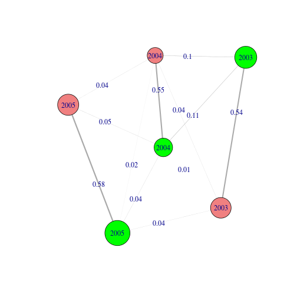
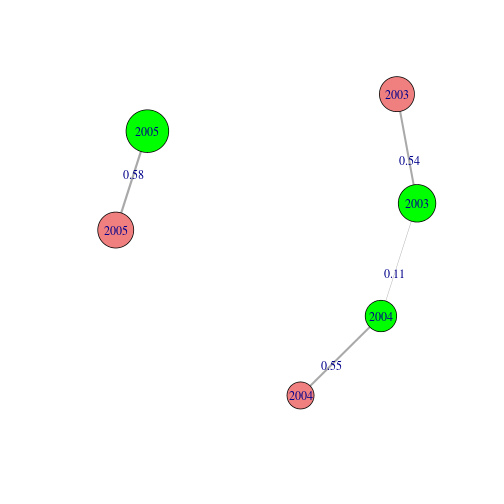
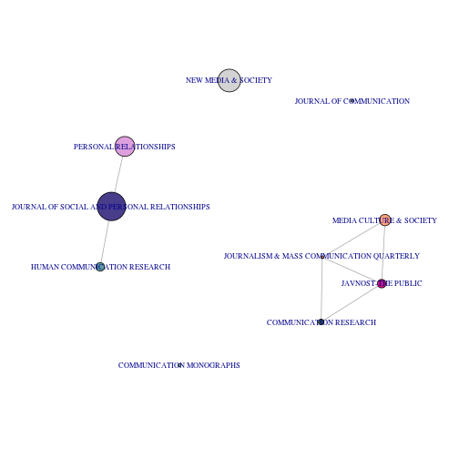
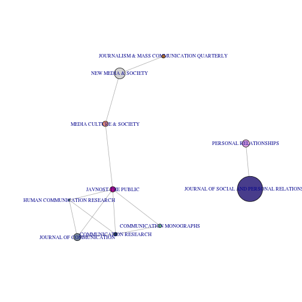
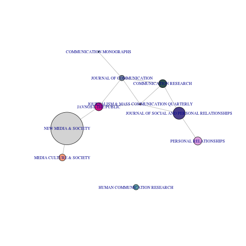

Content similarity networks
==========================

The similarity of the content of documents can be expressed as graphs/networks. This enables us to study, for instance, how homogenous communication is within certain communities, how similar different categories of documents are (e.g., different authors, news media) and how this changes over time.

In this howto we show several functions that can be used to create such similarity networks. The input consists of two objects: 

- A matrix in which rows are documents, and columns are content characteristics (e.g., words, issues, topics). This can for instance be a DocumentTermMatrix (from the tm package), codings based on content-analysis, or the output of a topic model. Since this type of matrix is often very sparse, the functions in the package were specifically designed to handle sparse matrices efficiently.
- A data.frame (or vector) with document meta, such as document-id, author, source and date

Creating the graph
=====================

The `content.similarity.graph` function can be used to create the graph. First, load the package and prepare the data.

As demo data we use speech acts in Dutch parliamentary proceedings by two parties (VVD and CDA) from 2003 till 2005 (samples of 100 proceedings per year)


```r
library(networktools)

load("../demo/parliamentary_proceedings.rdata")

dim(document.topic.matrix)  # A sparse matrix of documents X topics (in this case the results from a topic model (LDA). Sample from a set 73300 speech acts, with 200 topics)
```

```
## [1] 3295  200
```

```r
dim(meta)  # meta data for the documents in document.topic.matrix. 
```

```
## [1] 3295    7
```

```r
head(meta)
```

```
##             id       date speech_act                 meeting
## 33003 33907051 2003-01-29         48 h-tk-20022003-2793-2802
## 32995 33907175 2003-01-30         22 h-tk-20022003-2821-2849
## 81497 33909339 2003-02-18        248 h-tk-20022003-3055-3080
## 81480 33909445 2003-02-20         37 h-tk-20022003-3153-3161
## 81478 33909462 2003-02-20         54 h-tk-20022003-3153-3161
## 32630 33910920 2003-03-18          8 h-tk-20022003-3316-3327
##                         name party year
## 33003         De heer Blaauw   VVD 2003
## 32995    De heer Van Aartsen   VVD 2003
## 81497 Mevrouw Vroonhoven-Kok   CDA 2003
## 81480          De heer Atsma   CDA 2003
## 81478          De heer Atsma   CDA 2003
## 32630           De heer Zalm   VVD 2003
```


The `content.similarity.graph` function has 2 required arguments. `m` is the matrix giving the content characteristics per document. `vertex.grouping.vars` is a named list containing the meta veriables that are used to group the documents. The function returns a graph in the `igraph` format. 

Notable optional arguments are `similarity.measure` and `min.similarity`. With `similarity.measure` alternative methods to calculate the similarity between documents can be chosen. With `min.similarity` a threshold can be given for the edges/ties in the graph.


```r
g = similarity.graph(m = document.topic.matrix, vertex.grouping.vars = list(party = meta$party, 
    year = format(meta$date, "%Y")), similarity.measure = "correlation", min.similarity = 0)
```


We now have a graph object where nodes/vertices represent political parties per year, and ties represent the correlations in topics. Negative correlations are ignored, because the `min.similarity` is zero. 

Visualizing the graph
=====================

Graph objects in the igraph format can directly be visualized as networks using the plot() function. Arguments for plotting can be given in the plot() function, but also assigned as graph.attributes, vertex.attributes and edge.attributes. For instance, to set the size of vertices, the `vertex.size` argument can be used as `plot(g, vertex.size=10)`. Similarly, the vertex size can be given as a vertex attribute with the same name: `V(g)$size = 10`. If the vertex.size argument is then ignored in plot, the value of this attribute is used. For an overview of plotting options in igraph, see: `igraph.org/r/doc/plot.common.html`.

Let's set some basic arguments. Here we set vertex size based on the number of speech acts (the number of cases that are aggregated in `similarity.graph` is given as the vertex attribute V(g)$n)


```r
V(g)$size = sqrt(V(g)$n)  #set vertex size based on number of speech acts
```


Then we set the width of the edges based on the weight (the similarity score), and add the value as an edge label


```r
E(g)$width = E(g)$weight * 5
E(g)$label = round(E(g)$weight, 2)
```


We offer the `graph.color.vertices` function, which is a convenient way to color vertices. The function accepts a factor or character class vector to color vertices as categories. This will be used here to color vertices based on the party. 


```r
g = graph.color.vertices(g, as.character(V(g)$party))  # color vertices by party
```

```
##   attribute      color
## 1       VVD lightcoral
## 2       CDA      green
```


We also add the years as vertex labels.


```r
V(g)$label = as.character(V(g)$year)  # use year as vertex label
```


Now we can visualize the network with the `plot` function.


```r
plot(g)
```

 


From this network we can see that the strongest similarities are between the two parties within the same year, and that there are much weaker similarities between years, even within the same party.

Often it is usefull to filter a graph, such as deleting edges below a certain value or certain vertices. This is not possible with arguments to `plot`. To do so, a new graph object has to be created in which edges/vertices are deleted. For the sake of convenience, we offer the `graph.plot` function, which incorporates these steps.


```r
graph.plot(g, min.edge = 0.1)
```

 


Finally, one might prefer to visualize/analyze the graph in other software, such as gephi. The `write.graph` function in the `igraph` package offers various ways to write graphs to specific formats.

Another example
=====================

Now, let's review the steps for a different example, using abstracts in 10 communication sciences journals from Web of Science, with 'social network' as a topic, from 2001 till 2009


```r
load("../demo/abstracts_socialnet.rdata")

dim(document.topic.matrix)  # A sparse matrix of documents X topics (in this case a sample of the results from a topic model (LDA) over 848 abstracts, with 25 topics)
```

```
## [1] 147  20
```

```r
dim(meta)  # meta data for the documents in document.topic.matrix. 
```

```
## [1] 147   5
```

```r

g = similarity.graph(document.topic.matrix, vertex.grouping.vars = list(journal = meta$journal, 
    period = meta$period), similarity.measure = "correlation", min.similarity = 0)

g = graph.color.vertices(g, as.character(V(g)$journal))  # color vertices by journal
```

```
##                                       attribute           color
## 1                        COMMUNICATION RESEARCH   darkslategray
## 2                      JOURNAL OF COMMUNICATION  lightslategray
## 3  JOURNAL OF SOCIAL AND PERSONAL RELATIONSHIPS   darkslateblue
## 4                        PERSONAL RELATIONSHIPS            plum
## 5                  HUMAN COMMUNICATION RESEARCH       cadetblue
## 6                           NEW MEDIA & SOCIETY       lightgrey
## 7                            JAVNOST-THE PUBLIC mediumvioletred
## 8                       MEDIA CULTURE & SOCIETY     lightsalmon
## 9                      COMMUNICATION MONOGRAPHS      lightgreen
## 10    JOURNALISM & MASS COMMUNICATION QUARTERLY          orange
```

```r
V(g)$size = V(g)$n * 2  # use number of abstracts per node (year X journal) 
V(g)$label = as.character(V(g)$journal)  # use journal as vertex name
V(g)$label.cex = 0.7
```


In this example, we have used separate nodes for each journal X period combination. We can now plot different plots for each period


```r
graph.plot(g, min.edge = 0.3, select.vertices = V(g)$period == "2001/2003")
```

 

```r
graph.plot(g, min.edge = 0.3, select.vertices = V(g)$period == "2004/2006")
```

 

```r
graph.plot(g, min.edge = 0.3, select.vertices = V(g)$period == "2007/2009")
```

 

