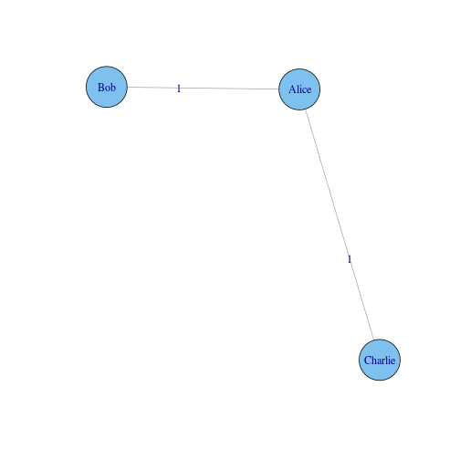
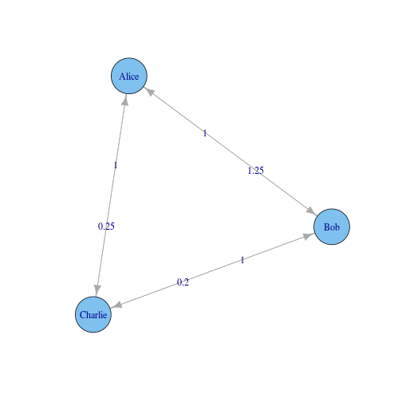
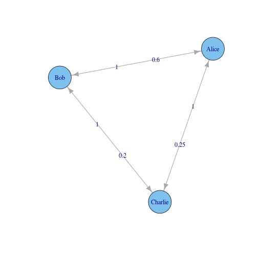

Communication networks
==========================

A social network is a network of actors (e.g., people, organizations). We can define a communication network as a social network in which ties represent information flows. For instance, people interacting on an online forum. We can study these communication networks by analyzing 1) who says what and 2) who communicates with whom. For the former we can use content analysis. For the latter we can use social network analysis. In this howto we focus on the latter, presenting several functions offered in the `networktools` package to create social networks based on common forms in which communication data is available. 


```r
library(networktools)
```


Communication data
==========================

In data regarding communication between actors, we can distinguish two main elements: content and metadata. Content refers to the texts that are communicated. Metadata refers to information about these texts, such as the name of the author and the publication date. Both can be used to estimate/identify who communicates with whom. In this howto we specifically focus on the use of metadata.

We use three vectors of metadata that are particularly relevant: actor, context and order. 
- actor: a vector with values that represent unique actors
- context: the context in which the actor communicated (e.g., thread, conversation)
- order: the order in which actors (within a context) communicated

The actor vector is always required. Depending on the type of data, either only contex, only order, or both context and order can be used to create a social network.

Actor & context
==========================

In some occasions, we only need to know the contexts in which actors communicated. For example, we can define edges representing communication between actors based on their participation in the same conversations, meetings or conferences, or based on their cooperation in writing articles (co-author networks). 

This can be represented in the following type of data structure:


```r
d = data.frame(actor = c("Alice", "Charlie", "Alice", "Bob"), context = c("A", 
    "A", "B", "B"), value = c(1, 1, 5, 5))
d
```

```
##     actor context value
## 1   Alice       A     1
## 2 Charlie       A     1
## 3   Alice       B     5
## 4     Bob       B     5
```


Based on this data structure, we can calculate the adjacency of actors based on their co-occurence in the same contexts. The networktools package contains the `adjacency` function for this purpose. The function has two main arguments:
- unit.vars: Vectors representing the units for which adjacency is calculated. In this case actors
- context: The context in which the actor occurs


```r
im = adjacency(unit.vars = list(author = d$actor), context = d$context)
im
```

```
## $matrix
## 3 x 3 sparse Matrix of class "dsCMatrix"
##   1 2 3
## 1 2 1 1
## 2 1 1 .
## 3 1 . 1
## 
## $dim.vars
##    author
## 1   Alice
## 2 Charlie
## 4     Bob
```


The matrix in the output shows the adjacency of the units. The dim.vars (dimension variables) show what the rows/columns of the matrix represent. So we can see that Alice occured once with both Bob and Charlie (row 1, columns 2 & 3), Bob only occured with Alice (row 3, column 1). The diagonal shows how often each actor occured with itself (which is simply the number of contexts in which he/she occured)

We can express this adjacency as a network. The igraph package offers the `graph.adjacency` function to create a graph out of an adjacency matrix. For the sake of convenience, we added the `as.graph` argument to the `adjacency` function to do this directly.


```r
g = adjacency(unit.vars = list(actor = d$actor), context = d$context, as.graph = T)
plot(g, edge.label = E(g)$weight, vertex.label = as.character(V(g)$actor), vertex.size = 30)
```

 


The output of the function, `g`, is a graph object in the igraph format. This object can be used to perform analyses in R or exported for analysis in alternative software packages (see also igraphs `write.graph` function). For more information on visualizing the network, please consult the R Documentation for `igraph.plotting`

Using other adjacency measures
==========================

By default, adjacency is calculated as the number of times actors occured in the same context (i.e. co-occurence). It is then ignored how often actors occur in each context. Other measures for adjacency can be given with the `measure` argument. With the `value` argument we can pass a value to the `adjacency` function to indicate how often a unit occured in a given context. To take this value into account for the calculation of adjacency, a measure such as `cosine` can be used.


```r
g = adjacency(unit.vars = list(actor = d$actor), context = d$context, value = d$value, 
    measure = "cosine", as.graph = T)
plot(g, edge.label = round(E(g)$weight, 2), vertex.label = as.character(V(g)$actor), 
    vertex.size = 30)
```

 


Now we see that Alice and Bob are closer than Alice and Charlie, because we have taken into account that Alice and Charlie occured often in context 'B'. 


Actor, context and order
==========================

In some situations merely using context is not enough to accurately capture the interactions between actors. This is often the case in conversations, where actors communicate in a given order. 

Consider the following data structure:


```r
d = data.frame(actor = c("Alice", "Bob", "Alice", "Charlie", "Bob", "Bob", "Alice", 
    "Bob", "Alice", "Bob"), conversation = c("A", "A", "A", "A", "A", "A", "B", 
    "B", "B", "B"), order = c(1, 2, 3, 4, 5, 6, 1, 2, 3, 4))
d
```

```
##      actor conversation order
## 1    Alice            A     1
## 2      Bob            A     2
## 3    Alice            A     3
## 4  Charlie            A     4
## 5      Bob            A     5
## 6      Bob            A     6
## 7    Alice            B     1
## 8      Bob            B     2
## 9    Alice            B     3
## 10     Bob            B     4
```


The data describes the order in which actors communicate in two distinct converstations. With this type of data, it is still possible to only use the context (in this case the conversation) to measure interactions between actors, but it can be usefull to take the order into account. Especially in long conversations with many different actors, it is more accurate to only estimate ties between actors that communicated within a given distance. Also, it might be relevant to take into account who responded to whom, to create a directed network. 

For this purpose, a simple incidence matrix is not sufficient. We offer the `windowed.adjacency` function, which looks at the co-incidence (or adjacency) of actors within windows of consequtive communications. As input, this function requires one or multiple vector indicating the actor, a vector containing the order in which actors communicated, and an integer indicating the size of the window. If the order in which actors communicated is restricted to contexts (as is the case in our example data), a vector for the context also needs to be given.


```r
windowed.adjacency(unit.vars = list(actor = d$actor), order = d$order, context = d$conversation, 
    window.size = 2)
```

```
## $matrix
## 3 x 3 sparse Matrix of class "dgCMatrix"
##           
## [1,] . 5 1
## [2,] 5 2 1
## [3,] 1 1 .
## 
## $dim.vars
##     actor n
## 1   Alice 4
## 2     Bob 5
## 4 Charlie 1
```


The output is an adjacency matrix in which rows and columns represent actors. The values indicate how many times these actors co-occured within windows. For example, with a window size of 2, Alice and Bob co-occured 5 times (which can be verified manually). Bob co-occured with himself once (rows 5 and 6 in `d`). 

With the `direction` argument, we can also take into account who responded to whom (by default direction is `undirected`). If direction is `up`, then the values for [i,j] represent how many times i occured after j in the given window size. 


```r
windowed.adjacency(list(actor = d$actor), d$order, d$conversation, window.size = 2, 
    direction = "up")
```

```
## $matrix
## 3 x 3 sparse Matrix of class "dgCMatrix"
##           
## [1,] . 2 .
## [2,] 3 1 1
## [3,] 1 . .
## 
## $dim.vars
##     actor n
## 1   Alice 4
## 2     Bob 5
## 4 Charlie 1
```


Now we can see, for instance, that Bob occured three times after Alice in a window.size of 2 (i.e. directly). In contrast, Alice occured after Bob only two times. 

Again, we added the `as.graph` argument for convenience.


```r
g = windowed.adjacency(list(actor = d$actor), d$order, d$conversation, window.size = 2, 
    as.graph = T)
plot(g, edge.label = E(g)$weight, vertex.label = as.character(V(g)$actor), vertex.size = 30)
```

 


We can also make the edge values relative to the total number of times actors communicated. `windowed.adjacency` gives this average as the edge attribute `E(g)$average.XY`


```r
plot(g, edge.label = E(g)$average.XY, vertex.label = as.character(V(g)$actor), 
    vertex.size = 30)
```

 


Since Alice occured only once in the same window with Charlie, and Alice communicated 4 times, the adjacency is on averate 0.25 (1/4).

Note that the value of the edge from Alice to Bob is above 1 (1.25). This is due to Bob talking before as well as after Alice in conversation B. Accordingly, the average number of times Bob talks within a window of 2 from Alice is 1.25. 

For various reasons it can be usefull to count actors only once per window. We then lose a bit of information, but interpretation becomes much easier. For instance, `E(g)$average.XY` can then simply be interpreted as the percentage of times an actor communicated within a given distance (window.size) of the other actor. The `windowed.adjacency` function therefore also has the `count.once` argument. If `count.once` is set to TRUE, then for each time an actor communicates, ties with unique other actors within the window are only counted once.


```r
g = windowed.adjacency(list(actor = d$actor), d$order, d$conversation, window.size = 2, 
    as.graph = T, count.once = T)
plot(g, edge.label = E(g)$average.XY, vertex.label = as.character(V(g)$actor), 
    vertex.size = 30)
```

 


Now we can more easily interpret that Alice always communicated within a window.size of 2 next to Bob (4 out of 4). For Bob, only in 60% of the times he communicated Alice was within a window.size of 2 (3 out of 5).
