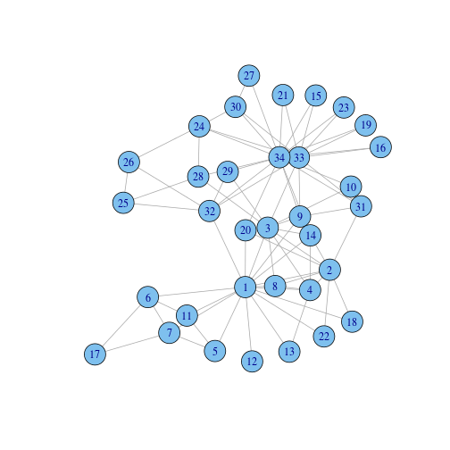

Networks in R using Igraph
========================================================

In the networktools package we mainly use the igraph package for working with networks. This is a basic introduction to using igraph.


```r
library(igraph)
```


Igraph offers several 'famous' graphs, which we can play with.

```r
`?`(graph.famous)
```


The 'Zachary' graph is a social network of friendships between 34 members of a karate club at a US university in the 1970's. 

```r
g = graph.famous("Zachary")
```


g is now a graph object in the igraph format. Graphs consist of nodes, or vertices, which are connected with ties, or edges. In igraph the terminology vertices and edges is used.

Accordingly, graph objects contain two types of data: vertices and edges

```r
V(g)  # this shows the 34 vertices (V for vertices)
```

```
## Vertex sequence:
##  [1]  1  2  3  4  5  6  7  8  9 10 11 12 13 14 15 16 17 18 19 20 21 22 23
## [24] 24 25 26 27 28 29 30 31 32 33 34
```

```r
head(E(g))  # shows the 78 edges (E for edges). The numbers match the vertices. (only 6 edges shown due to using head())
```

```
## Edge sequence:
##           
## [1] 2 -- 1
## [2] 3 -- 1
## [3] 4 -- 1
## [4] 5 -- 1
## [5] 6 -- 1
## [6] 7 -- 1
```


Both vertices and edges can also have attributes. For instance, since the vertices in g represent people, it can be usefull to know the gender, age, etc. of each person. The vertex.attributes() function gives a list of all vertex attributes for a given graph object.


```r
vertex.attributes(g)  # this gives a list of all vertex attributes. Currently it's empty (for this network we only know that each vertex is a person)
```

```
## list()
```


Since there are currently no vertex attributes, let's add one for reference. We'll randomly add gender (feminist theory not intended). After using the V function to select the vertices of the graph object, we can add vertex attributes similar to how we work with lists or data.frames.


```r
V(g)$male = sample(c(0, 1), length(V(g)), replace = T)  # randomly pick 0 or 1, for as many times as there are vertices
vertex.attributes(g)
```

```
## $male
##  [1] 0 0 1 1 1 1 0 0 0 0 1 0 1 0 0 1 0 0 1 1 1 0 1 0 0 0 1 1 0 1 0 0 1 1
```

```r
V(g)$male
```

```
##  [1] 0 0 1 1 1 1 0 0 0 0 1 0 1 0 0 1 0 0 1 1 1 0 1 0 0 0 1 1 0 1 0 0 1 1
```


A common edge attribute is weight (i.e. how strong is the tie). Edge attributes can be listed with the edge.attributes() function, and accessed with the E function. 


```r
edge.attributes(g)  # this gives a list of all edge attributes. Currently also empty (every edge only represents, dichotomously, that there is an edge)
```

```
## list()
```


For reference, let's also randomly add a value for the strenght of the friendship.


```r
E(g)$friendship = sample(1:10, length(E(g)), replace = T)  # randomly pick a number from 1 to 10, for as many times as the number of edges
edge.attributes(g)
```

```
## $friendship
##  [1] 10 10  3  6  8  8  5  9  7  9  2  4  7  9  3  4  8  2  8 10  4  6  7
## [24]  6  1  8  6  2  8  1  6  7  7  1  7  2  4  3  6  7  6  6  4  5  1  5
## [47]  5  8  4  3  3  5  1  6  1  3  2  8  7  5  3  4  5  7  1  1  1  6  6
## [70]  8  9  3 10  4  4  7 10  3
```


Also note that edges can be 'undirected' or 'directed'. An undirected edge means that two nodes are symmetrically connected. A directed edge means that the relation of vertex 1 to vertex 2 can be different from the relation of vertex 2 to vertex 1. In the edge sequence of g we can see that edges are undirected (notated with dashes: 2 -- 1), and not directed (notated with arrows: 2 -> 1). 

Now for the more fun part: visualizing!
graphs in the Igraph format can simply be visualized as networks with the plot function


```r
plot(g)
```

 


Fun, but still a bit messy. Off course, there are many choices to be made to plot a network. A prominent choice is the type of algorithm used to determine the location of the vertices. This is called the layout, which can be passed directly to the plot function.


```r
`?`(layout  # (go for 'General coordinates for plotting graph', for the igraph package)
)
```

```
## Help on topic 'layout' was found in the following packages:
## 
##   Package               Library
##   igraph                /home/kasper/R/x86_64-pc-linux-gnu-library/3.1
##   graphics              /usr/lib/R/library
## 
## 
## Using the first match ...
```


```r
plot(g, layout = layout.circle)
```

 

```r
plot(g, layout = layout.fruchterman.reingold)
```

 


For more information of more pretty plotting, we can also change attributes such as the colors, sizes and labels of vertices, or the weight, width and labels of edges. All can be directly passed to the plot function.


```r
plot(g, vertex.size = 5, vertex.label = "", vertex.color = "orange", edge.width = 0.5, 
    edge.color = "black")
```

 


A list of more attributes to change can be found here:

```r
`?`(igraph.plotting)
```


A convenient feature is that we can also pass these arguments by including them as vertex and edge attributes. We then add these attributes with the same names as the arguments passed to the plot function, but excluding the 'vertex.' and 'edge.' prefixes.


```r
V(g)$size = 4
V(g)$label = ""
V(g)$color = "red"
E(g)$width = 2
E(g)$color = "grey"

plot(g)
```

 


Note that these attributes are now assigned equally to every vertex and edge


```r
vertex.attributes(g)
```

```
## $male
##  [1] 0 0 1 1 1 1 0 0 0 0 1 0 1 0 0 1 0 0 1 1 1 0 1 0 0 0 1 1 0 1 0 0 1 1
## 
## $size
##  [1] 4 4 4 4 4 4 4 4 4 4 4 4 4 4 4 4 4 4 4 4 4 4 4 4 4 4 4 4 4 4 4 4 4 4
## 
## $label
##  [1] "" "" "" "" "" "" "" "" "" "" "" "" "" "" "" "" "" "" "" "" "" "" ""
## [24] "" "" "" "" "" "" "" "" "" "" ""
## 
## $color
##  [1] "red" "red" "red" "red" "red" "red" "red" "red" "red" "red" "red"
## [12] "red" "red" "red" "red" "red" "red" "red" "red" "red" "red" "red"
## [23] "red" "red" "red" "red" "red" "red" "red" "red" "red" "red" "red"
## [34] "red"
```

```r
edge.attributes(g)
```

```
## $friendship
##  [1] 10 10  3  6  8  8  5  9  7  9  2  4  7  9  3  4  8  2  8 10  4  6  7
## [24]  6  1  8  6  2  8  1  6  7  7  1  7  2  4  3  6  7  6  6  4  5  1  5
## [47]  5  8  4  3  3  5  1  6  1  3  2  8  7  5  3  4  5  7  1  1  1  6  6
## [70]  8  9  3 10  4  4  7 10  3
## 
## $width
##  [1] 2 2 2 2 2 2 2 2 2 2 2 2 2 2 2 2 2 2 2 2 2 2 2 2 2 2 2 2 2 2 2 2 2 2 2
## [36] 2 2 2 2 2 2 2 2 2 2 2 2 2 2 2 2 2 2 2 2 2 2 2 2 2 2 2 2 2 2 2 2 2 2 2
## [71] 2 2 2 2 2 2 2 2
## 
## $color
##  [1] "grey" "grey" "grey" "grey" "grey" "grey" "grey" "grey" "grey" "grey"
## [11] "grey" "grey" "grey" "grey" "grey" "grey" "grey" "grey" "grey" "grey"
## [21] "grey" "grey" "grey" "grey" "grey" "grey" "grey" "grey" "grey" "grey"
## [31] "grey" "grey" "grey" "grey" "grey" "grey" "grey" "grey" "grey" "grey"
## [41] "grey" "grey" "grey" "grey" "grey" "grey" "grey" "grey" "grey" "grey"
## [51] "grey" "grey" "grey" "grey" "grey" "grey" "grey" "grey" "grey" "grey"
## [61] "grey" "grey" "grey" "grey" "grey" "grey" "grey" "grey" "grey" "grey"
## [71] "grey" "grey" "grey" "grey" "grey" "grey" "grey" "grey"
```


Accordingly, we can also use existing vertex and edge attributes to set these attributes. For example, we can use gender to set the colors of nodes and the value for friendship strength to set the width of the edges.


```r
V(g)$color = "blue"
V(g)$color[V(g)$male == 1] = "red"
E(g)$width = sqrt(E(g)$friendship)

plot(g)
```

 

